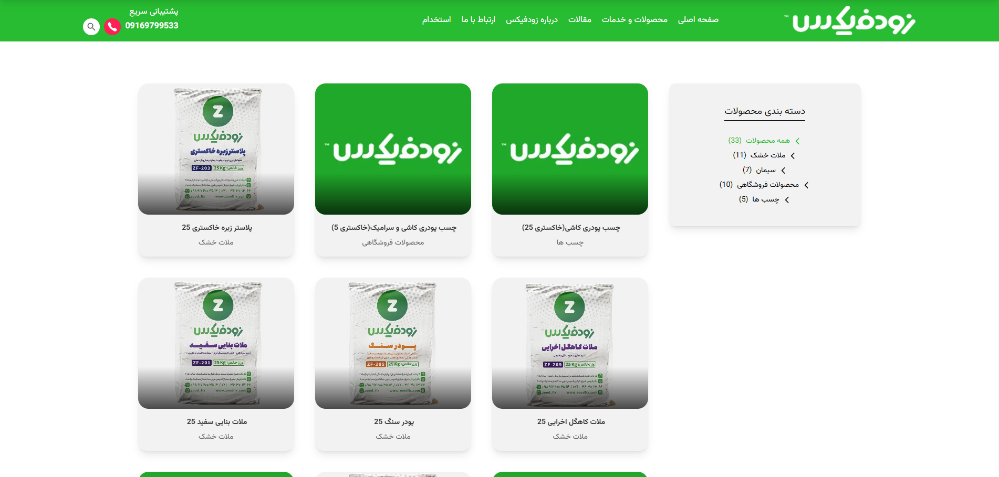

# 🛒 ZoodFix — E-Commerce UI

A pixel-accurate rebuild of the ZoodFix e-commerce platform, focused on practicing production-grade Next.js architecture, strict TypeScript, and performance optimization.

🔗 [Visit Site](https://zoodfix.vercel.app)

---

## 📁 Screenshots

> | 🏠 Home                         | 🛍️ Products                             |
> | ------------------------------- | --------------------------------------- |
> |  |  |

---

## 🧠 Tech Stack

| Layer      | Technology               |
| ---------- | ------------------------ |
| Framework  | Next.js 14 (App Router)  |
| Language   | TypeScript (strict mode) |
| Styling    | Tailwind CSS             |
| Data       | JSON mock fixtures       |
| Deployment | Vercel                   |

---

## ⚡ Technical Highlights

- **Type-safe data layer**: Custom TypeScript interfaces for all product, category, and cart entities — defined in a dedicated `/types` directory
- **Component architecture**: Fully decomposed UI with reusable, single-responsibility components across product cards, layout, and navigation
- **Performance**: Lighthouse 90+ via Next.js Image optimization, static generation for product pages, and mobile-first responsive layout
- **Data fixtures**: Structured mock data in `/validData` separating UI logic from data concerns — ready for API replacement
- **Strict TypeScript**: No `any` types — all props, API shapes, and state fully typed throughout

---

## 📁 Project Structure

```
src/
├── app/                 # Next.js App Router routes
│   ├── page.tsx         # Homepage
│   └── [category]/      # Category and product pages
├── components/          # Reusable UI components
├── types/               # TypeScript interfaces and types
├── validData/           # Structured mock data fixtures
└── public/              # Static assets
```

---

## ⚙️ Setup & Run Locally

```bash
# Clone the repository
git clone https://github.com/mostafakm78/zoodfix.git

# Navigate to project directory
cd zoodfix

# Install dependencies
npm install

# Start the development server
npm run dev
```

Open [http://localhost:3000](http://localhost:3000) in your browser.

---

## 🚀 Roadmap

### ✅ Shipped

- [x] Pixel-accurate responsive UI
- [x] TypeScript-strict component architecture
- [x] Reusable component system
- [x] Structured mock data layer
- [x] Mobile-first responsive design

### 🔜 Upcoming

- [ ] Cart state management with Redux Toolkit
- [ ] Connect to a real REST API
- [ ] Product search and filter functionality
- [ ] Unit tests with React Testing Library

---

## 📜 License

This project is open-source under the [MIT License](LICENSE).

---

## 🧑‍💻 Author

**Mostafa Kamari** — Frontend Developer · React & Next.js

[GitHub](https://github.com/mostafakm78) · [LinkedIn](https://linkedin.com/in/mostafa-kamari) · [Portfolio](https://portfolio-immostafakamari.vercel.app)
